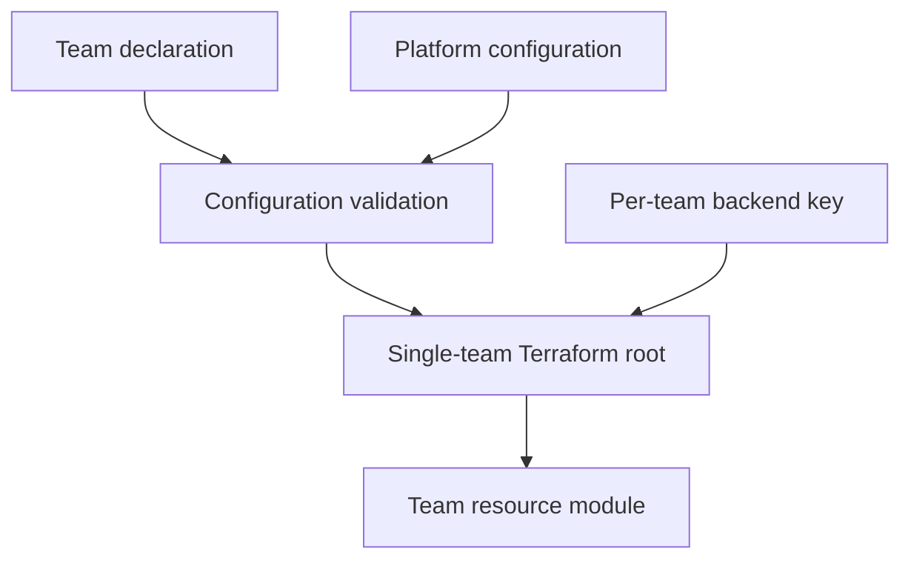

# Terraform team platform

A Terraform take-home implementation for self-service team S3 resources. A reusable module creates resources for one team at a time; each team owns a declaration file. CI runs without AWS. A separate, disabled-by-default deployment workflow uses one remote Terraform state object per team.

## Architecture



`modules/team-resources/` is the reusable platform module. It creates a team IAM role and the S3 buckets requested by one team.

`live/` is the Terraform root configuration. A CI run invokes it once for each selected team.

`teams/<team>.tfvars` is owned by the team and declares its identity, approved workload role, and buckets. `platform/dev.tfvars` holds centrally managed account-wide values such as namespace, account ID, and AWS region.

CI parses each declaration as HCL and requires `team_name` to equal its filename stem. This binds resource identity to the team ID used for change detection and state selection. For example:

```text
teams/payments.tfvars -> team ID: payments -> state key: teams/payments/terraform.tfstate
```

This is deliberately not an all-team Terraform `for_each`: one Terraform execution manages one team and one state file.

## Repository layout

```text
.github/workflows/terraform.yml       CI: validation, tests, changed-team detection
.github/workflows/deploy.yml          Optional real plan -> review -> apply workflow
.github/actions/validate-config/      Reusable inline HCL preflight validation
.github/tests/test_ci.py              Regression tests for actual workflow logic
.github/requirements.txt              Pinned Python test/parser dependencies
modules/team-resources/               Reusable S3 and IAM module
  tests/team.tftest.hcl               Module contract tests with mocked AWS
live/                                 Root configuration for one team execution
  tests/team.tftest.hcl               Reusable per-team root wiring test
platform/dev.tfvars                   Platform-owned environment configuration
teams/payments.tfvars                 Payments resource declaration
teams/fraud.tfvars                    Fraud resource declaration
```

## Team declaration

Example `teams/payments.tfvars`:

```hcl
team_name = "payments"

trusted_role_arn = "arn:aws:iam::123456789012:role/payments-workload"

buckets = {
  receipts = {
    visibility = "private"
  }

  assets = {
    visibility = "public"
  }
}
```

Every bucket must explicitly declare `visibility = "public"` or `visibility = "private"`; there is no default. The `buckets` map must contain at least one bucket. Each map key is a stable resource identity, so renaming a key can cause Terraform to replace that bucket.

Team files may contain only `team_name`, `trusted_role_arn`, and `buckets`; bucket objects may contain only `visibility`. CI rejects platform overrides, unknown fields, mismatched team names, and wildcard role principals before running Terraform. Platform values are also loaded last for final precedence. Terraform variable files are configuration input, not an access-control boundary on their own.

Example `platform/dev.tfvars`:

```hcl
namespace  = "demo-dev"
account_id = "123456789012"
aws_region = "eu-central-1"
```

The module enforces bucket names in this form:

```text
<namespace>-<team>-<purpose>-<account-id>
```

For example, `payments` and `receipts` produces:

```text
demo-dev-payments-receipts-123456789012
```

AWS remains the authority on global S3 bucket-name availability.

`trusted_role_arn` is an existing workload identity allowed to assume the new generated team S3 role. It could be an EKS IRSA role, ECS task role, Lambda execution role, or another approved application identity. The module does not trust an AWS-account wildcard principal.

## Local prerequisites and mock tests

On macOS:

```bash
brew install git jq python@3.12 node
brew tap hashicorp/tap
brew install hashicorp/tap/terraform
terraform version
```

CI uses Terraform 1.9.8 and AWS provider 5.x. Homebrew may install a newer Terraform; use a version manager for an exact local match or deliberately update `.terraform-version` and both workflow pins together. Python 3.12 parses HCL and runs workflow regression tests; Node executes the actual inline change-detector JavaScript in those tests. There is no separate provisioning script.

Run from the repository root:

```bash
python3.12 -m venv .venv
source .venv/bin/activate
python -m pip install -r .github/requirements.txt
python -m unittest discover -s .github/tests -v

terraform fmt -check -recursive

terraform -chdir=modules/team-resources init -backend=false
terraform -chdir=modules/team-resources validate
terraform -chdir=modules/team-resources test

terraform -chdir=live init -backend=false
terraform -chdir=live validate

terraform -chdir=live test \
  -var-file=../teams/payments.tfvars \
  -var-file=../platform/dev.tfvars

terraform -chdir=live test \
  -var-file=../teams/fraud.tfvars \
  -var-file=../platform/dev.tfvars
```

Terraform downloads the AWS provider during `init`, but these tests need no AWS credentials and create no AWS resources. Tests use Terraform's `mock_provider "aws" {}` capability.

## Testing strategy

The module test uses fixed representative inputs for Payments. This lets it assert exact resource names, policy JSON, tags, encryption, versioning, public/private settings, and IAM permissions. It is a module contract test, not a test for a specific live team.

The root test is parameterized. CI runs the same test file using each changed team's actual `.tfvars` file. It verifies exact bucket keys and names, including team, namespace and account, rather than only counting outputs.

The Python suite executes the validator extracted from the composite action and the JavaScript extracted from the detection job. Git/GitHub inputs are mocked, not the selection algorithm. It checks identity mismatch, platform overrides, invalid declarations, shared changes, deletion, README-only changes, and 301 teams appearing exactly once. Additional workflow-structure checks protect main-only opt-in gates, platform precedence, global deployment serialization, artifact handoff and approval placement. These do not replace an actual AWS deployment test.

Mock tests cover:

- Resource count, deterministic names, and ownership tags.
- Empty bucket maps, invalid bucket keys, invalid team names, and invalid visibility values.
- Bucket-owner-enforced object ownership, default AES256 encryption, HTTPS-only policies, versioning, and `force_destroy = false`.
- Private bucket public-access blocking.
- Public bucket anonymous object reads only, with no anonymous writes or listing.
- Exact least-privilege IAM bucket/object permissions and the configured trust principal.

Mock tests do not prove AWS API acceptance, effective IAM authorization, account-level public-access controls, global name availability, backend locking, or real idempotency. A protected sandbox integration suite should deploy two teams, verify each role can access only its own private bucket, test public HTTPS reads, verify denied anonymous writes/listing, re-plan for no changes, and test state locking.

## CI/CD

The credential-free `terraform.yml` workflow has three jobs:

1. `test` validates the declaration contract, runs workflow regression tests, formatting, Terraform validation and module mock tests.
2. `detect` validates declarations and compares Git changes. A change to `teams/payments.tfvars` selects Payments. A change under `modules/`, `live/`, `platform/`, or `.github/` selects all teams. Manual dispatch and a first push select all teams.
3. `mock_team_tests` runs the root mock test for each selected team. This runs on pull requests without AWS credentials.

For mock tests, teams are distributed over at most 20 batches, with five concurrent jobs. The 301-team regression test checks complete, duplicate-free selection within that limit. It is not a benchmark of 301 real AWS deployments.

The separate `deploy.yml` workflow is disabled unless the repository variable `TERRAFORM_DEPLOY_ENABLED` is exactly `true`. Both plan and apply jobs also require `refs/heads/main`, including manual dispatch. Its sequence is:

1. Check the entire current configuration and reject a stale commit before obtaining AWS credentials.
2. Plan **all current teams** sequentially, with independent state keys and saved binary plans. Upload the plans and human-readable `.txt` versions as an artifact bound to the commit and backend settings.
3. Wait for approval on the `terraform-production` Environment. Review the uploaded plans before approving; the artifact link appears in the plan job summary.
4. Re-check main and backend settings, then apply the exact saved plans. Do not re-plan after approval. Re-check main between teams; if it advances, stop and run a fresh deployment of main.

Whole-workflow concurrency spans planning, approval and application. There is no deployment matrix sharing a single job-level group. GitHub may replace pending workflow runs; because each surviving deployment reconciles every current team, updates from a skipped intermediate commit remain included. `cancel-in-progress: false` prevents a newer run cancelling a running apply, but does not guarantee delivery of every intermediate commit or prevent manual cancellation/timeouts.

Sequential deployment is intentionally conservative and slower than mock CI. Each job has a six-hour limit; large real installations need measured runtimes, credential lifetimes, durable queues and independent team approvals. A partial apply is possible; re-plan all teams against their latest states to recover. Backend locking still protects against other Terraform clients, and saved plans fail if their state snapshot has become stale.

The deployment loop provides state isolation:

```bash
terraform -chdir=live init -reconfigure \
  -backend-config="key=teams/$team/terraform.tfstate"
```

Payments and Fraud therefore use different S3 objects and separate DynamoDB lock identities:

```text
teams/payments/terraform.tfstate
teams/fraud/terraform.tfstate
```

Existing state keys remain unchanged. This repository targets one account/environment. Before adding another environment, use a distinct backend bucket or an explicitly migrated environment-prefixed key; do not change existing keys casually. `TF_WORKSPACE=default` keeps plan and apply on the same backend workspace.

## Enabling real AWS deployment

The backend is bootstrap infrastructure and must exist before team deployments. It is separate from the team state it stores.

Create or obtain:

- A private, encrypted, versioned S3 state bucket.
- A DynamoDB lock table with a string partition key named `LockID` for Terraform 1.9.8 locking.
- A GitHub OIDC provider and two deployment identities: a plan role with infrastructure read/state-read and lock permissions, and an apply role with the required backend/S3/IAM write permissions. Neither is a generated workload role.
- GitHub Environments named `terraform-plan` and `terraform-production`. Restrict both to `main`; require reviewers on `terraform-production` and disable bypass where available. The YAML alone does not create or enforce these settings.
- OIDC trust restricted to audience `sts.amazonaws.com` and the respective subject `repo:asherahmed/SumUpTerraform:environment:terraform-plan` or `repo:asherahmed/SumUpTerraform:environment:terraform-production`. Environment subjects do not include a branch, so Environment branch restrictions and workflow guards are also necessary.

Configure these values before deliberately enabling deployment:

| Name | Type | Purpose |
|---|---|---|
| `TERRAFORM_DEPLOY_ENABLED` | Repository variable | Leave unset/false for mock CI; set `true` only after setup and review |
| `AWS_REGION` | Repository variable | Backend/authentication region; use `eu-central-1` for the supplied configuration |
| `TF_STATE_BUCKET` | Repository variable | Existing Terraform-state S3 bucket |
| `TF_LOCK_TABLE` | Repository variable | Existing DynamoDB lock table |
| `TERRAFORM_PLAN_ROLE_ARN` | `terraform-plan` Environment secret | Plan-only identity |
| `TERRAFORM_DEPLOY_ROLE_ARN` | `terraform-production` Environment secret | Apply identity |

Use the same backend variables in both jobs and replace placeholder account/workload ARNs before real deployment. Do not override backend settings differently per Environment. Plan artifacts can contain sensitive values: restrict access, do not commit them, and note their three-day retention. Expired/stale plans require a fresh plan and approval. Real AWS access, permissions, locking, and multi-team idempotency still need sandbox verification; mock CI success is not that verification.

In production, restrict deployment identities to the required state prefixes. Separate S3 keys isolate Terraform state operationally, but an over-privileged identity could still read another team's state.

## Security decisions

- Private buckets block public ACLs and public bucket policies.
- Public buckets still disable ACL-based access. Their resource policy permits only anonymous `s3:GetObject` against that bucket's objects; it permits no anonymous write or list action.
- Every bucket denies unencrypted HTTP transport, enables versioning, and configures default AES256 encryption.
- Account-level S3 Block Public Access or an SCP may intentionally reject public bucket policies. Public access therefore requires an approved account posture; a private bucket behind CloudFront is often preferable.
- The generated team role has no IAM administration, bucket-policy administration, or access to other teams' bucket ARNs. It permits only `ListBucket`, `GetBucketLocation`, `GetObject`, `PutObject`, and `DeleteObject` for its own resources.
- Public objects are intentionally accessible by everyone, including other teams. This is incompatible with absolute cross-team denial for those objects.
- The module omits KMS, multipart-upload actions, lifecycle controls, and object-version deletion permissions until a workload needs them.
- A single inline IAM policy is clear for this exercise. Very large bucket counts per team can hit IAM policy-size quotas; production designs may split policies or use approved ABAC patterns.

## Onboarding, ownership, and offboarding

To onboard a normal team, add `teams/<team>.tfvars`, declare a nonempty bucket map, and open a pull request. No module or workflow code changes are required.

Use CODEOWNERS and branch protection in a real organization: require team review for a team's file, platform review for shared module/workflow files, and an approval policy for new public buckets and trusted workload principals. Repository directory boundaries alone are not authorization.

CI blocks deletion or rename of a team declaration. A team is offboarded through a separate, reviewed maintenance process:

1. Stop writers and decide whether data is retained, archived, or deleted.
2. Initialize Terraform with that team's original backend key.
3. Create and review a `terraform plan -destroy` plan using the original team declaration.
4. Empty/archive bucket data only through an approved data-handling process; versioned buckets require handling object versions and delete markers.
5. Apply the approved destroy plan, archive final state/audit evidence, revoke access, then remove the team declaration.

The deletion gate requires an explicitly reviewed exception for that final removal; no automatic destroy or offboarding bypass is provided. Protect main and require the CI check so deletion failures cannot be ignored during merge. The deployment workflow reconciles current declarations only; it never interprets an absent file as permission to delete old resources.

`force_destroy = false` prevents Terraform from silently emptying a nonempty bucket. It does not prevent deletion of an empty bucket, so deployment approval and destructive-plan review remain necessary.

## References

- https://developer.hashicorp.com/terraform/language/tests
- https://developer.hashicorp.com/terraform/language/tests/mocking
- https://developer.hashicorp.com/terraform/language/backend/s3
- https://docs.aws.amazon.com/AmazonS3/latest/userguide/access-control-block-public-access.html
# PR plan comments

For same-repository pull requests, CI posts and updates one **mock plan preview**
comment for the affected teams. `terraform test -verbose` shows the planned
resources using mocked AWS; this is not a live AWS plan and does not compare
against deployed state. Real saved plans remain in the opt-in deployment workflow.

The comment includes check status and a link to full run output/artifacts. Large
previews are truncated to fit GitHub's comment limit; full artifacts are retained
for three days. Failed tests also upload their output, and still fail CI. An older
commit's run skips commenting if the PR head has moved on.

Only the separate commenting job gets `pull-requests: write`; it does not check out
or execute repository code or use AWS credentials. Fork PRs skip commenting because
their tokens are read-only, but still generate previews and artifacts. No
`pull_request_target` workflow is used.
